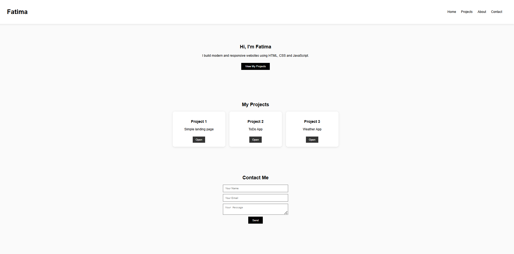

Skip to content
fatimamassbali-web
portfolio-fatima-
Repository navigation
Code
Issues
Pull requests
Actions
Projects
Wiki
Security and quality
Insights
Settings
Commit 6fb7f67
fatimamassbali-web
fatimamassbali-web
authored
17 hours ago
·
·
Verified
Initial commit
main
0 parents  commit 
6fb7f67
1 file changed

+1
Lines changed: 1 addition & 0 deletions
File tree
Filter files…
README.md
1
Search within code
 
‎README.md‎
+1
Lines changed: 1 addition & 0 deletions

Original file line number	Diff line number	Diff line change
@@ -0,0 +1 @@
Comment view
# 🌐 Portfolio – Fatima Massbali
fatimamassbali-web commented now
@fatimamassbali-web
fatimamassbali-web
now
Owner
Author
🌐 Portfolio – Fatima Massbali
📌 Description
This project is a personal portfolio website created as a final project for the Advanced JavaScript course.
It presents my profile, skills, and projects using a clean and responsive design.

The website is fully functional and demonstrates the use of HTML, CSS, JavaScript, DOM manipulation, and event handling.

🚀 Features
Responsive layout (desktop & mobile)
Navigation menu
Projects section with cards
Smooth scrolling interaction using JavaScript
Contact form with JavaScript event handling
Deployed online using GitHub Pages
🛠 Technologies Used
HTML5
CSS3
JavaScript (Vanilla JS)
Git & GitHub
GitHub Pages
🎨 Design
UI/UX designed with Figma
Desktop and mobile versions
🔗 Figma design link: https://www.figma.com/design/3bQfwaWhKfhsrn2FqeL75Y/Fatima-Ezzahra-Massbali-s-team-library?node-id=3311-2&t=vfSQ5GKJ7Gg33gBt-1

🌍 Live Demo
🔗 Website link:
https://fatimamassbali-web.github.io/portfolio-fatima-/

📸 Screenshot

📚 What I Learned
Structuring a complete front-end project
DOM manipulation and event handling in JavaScript
Using GitHub for version control
Deploying a project with GitHub Pages
👩‍💻 Author
Fatima Massbali
Web Development Student

Write a reply
0 commit comments
Comments
0
 (0)
Comment
You're not receiving notifications from this thread.

